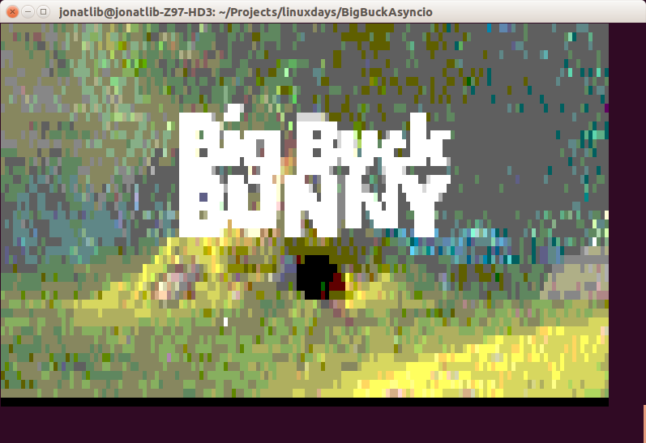

# Play ASCII video in telnet through the magic of asyncio



This is a TCP server that streams colorful ASCII video in your terminal. Follow [the tags](https://github.com/qntln/big-buck-asyncio/releases) to see how this asyncio application was developed step by step.

The server plays ASCII art video files created with the script bundled in `convert/convert.py`.

To see the videos, simply connect to the server with telnet.


## Videos

This repository contains the [Big Buck Bunny](https://peach.blender.org/about/) movie converted to ASCII art frames.

[img2txt](https://github.com/hit9/img2txt) was used to convert each video frame to ASCII art. Learn more about video conversion in `convert/README.md`.

## Requirements

This project requires Python 3.5. If you don't have Python 3.5 but you have Docker installed you can use the `bin/container.sh` wrapper which will run our application in a Python 3.5 image in Docker.

## Installation
 
To install all required packages run:

```
pip install -r requirements.txt
```

## Running the server

To run the server use this simple command:

```
./bin/main.py <video file>
```

For example:

```
./bin/main.py bigBuckBunny.ascii.bz2
```

Or, if you don't have Python 3.5 you can run our server in Docker using this wrapper:

```
./bin/container.sh
```

It has no arguments and plays the above example file.

## Accessing the server

Simply use telnet:

```
telnet localhost 8000
```
